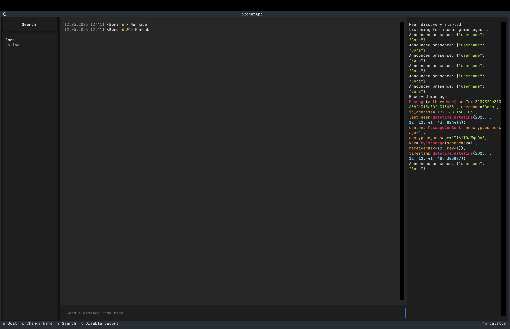
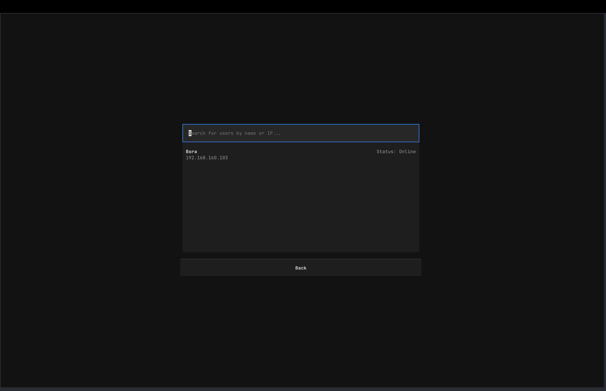
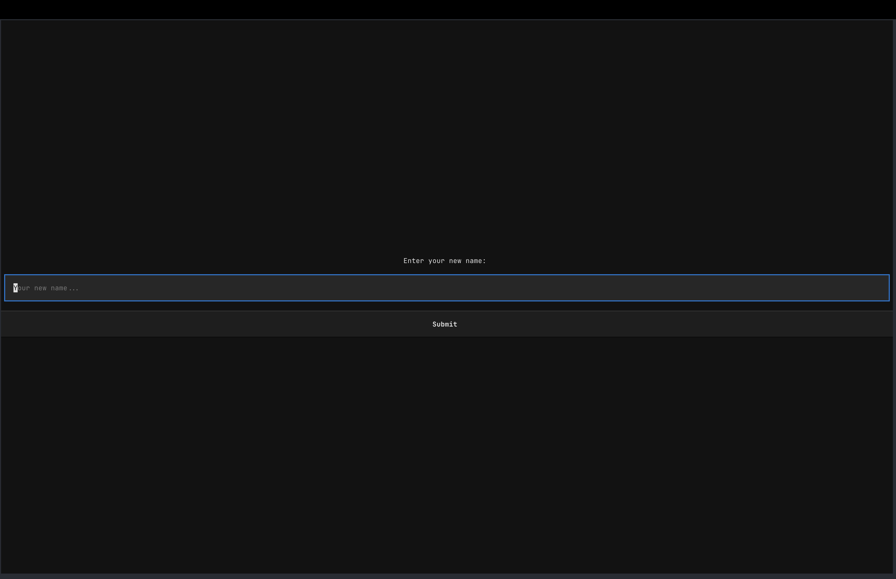
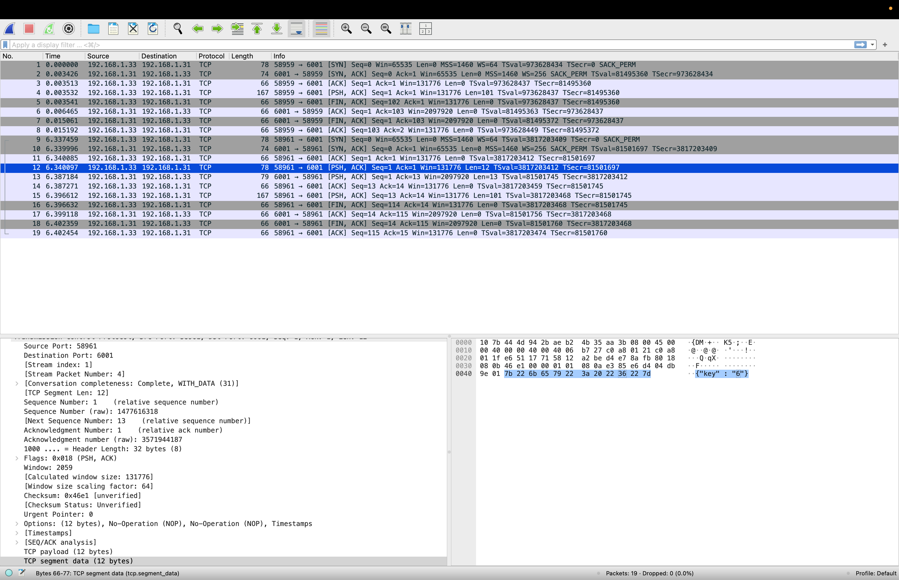
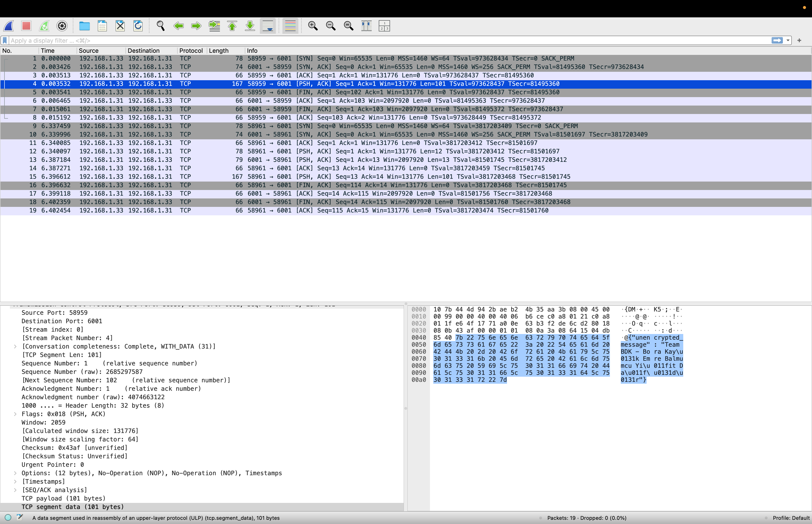
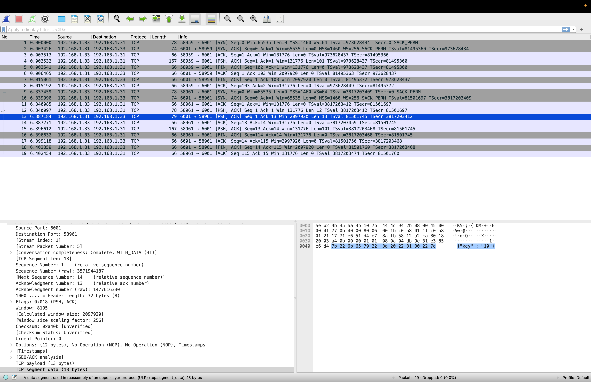
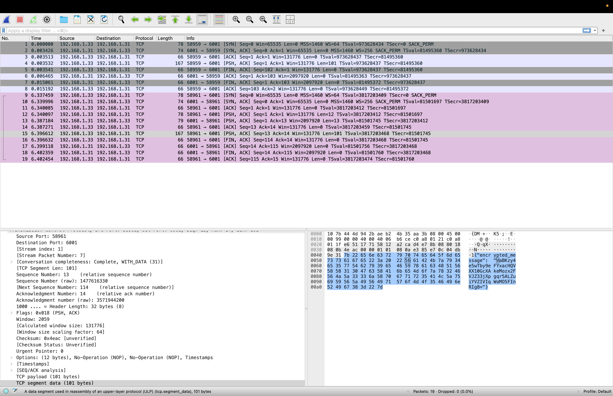

# P2Chat
BAU CMP2204 - Introduction to Computer Networks team BDK's Term Project
## Team Members
- Bora Kayık
- Emre Balmumcu
- Yiğit Dağıdır

P2Chat is a simple peer-to-peer chat application with tui built using [textual](https://www.textualize.io/) framework. It allows users to connect with each other and send messages in real-time.

### Running the project
This project is made using [uv](https://docs.astral.sh/uv/) package manager. 
You need to have `uv` added in your path in order to run the commands below.
uv can be installed from [here](https://docs.astral.sh/uv/getting-started/installation/).

Bellow command will automatically install the required dependencies, use the proper python version and run the project. uv really is awesome
```bash
uv run p2chat
```

### Known Issues 
- The tui can't work as expected on some terminal emulators due to the lack of support for certain features. So it's recommended to use terminals mentioned on the [textual documentation](https://textual.textualize.io/getting_started/#requirements). The development of this project is done on new [Windows Terminal](https://apps.microsoft.com/detail/9n0dx20hk701?hl=en-GB&gl=GB) and [Ghostty](https://ghostty.org/) which work as intended in this project and are recommended.

### Notes
- Wireshark captures can be found in the `images/wireshark` folder.

## Images

### Tui
| Images                                                                                                    |
|-----------------------------------------------------------------------------------------------------------|
|  Message sending  |
|  Search Users                                           |
| Change Username                                   |


### Wireshark

| Encrypted Messages                                                                             | Uncrypted message                                                                                     |
|------------------------------------------------------------------------------------------------|-------------------------------------------------------------------------------------------------------|
|  Key Send                                       |  Sending the message unencrypted |
|  Key Receive                                 | -                                                                                                     |
|  Sending the message encrypted | -                                                                                                     | 